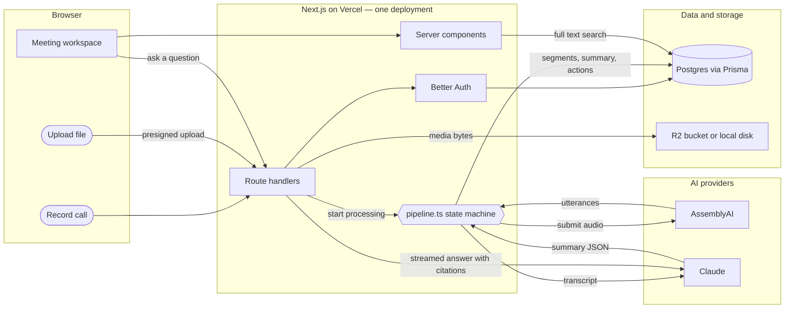

# Cadence — AI meeting notetaker

A rebuild of [Fathom](https://fathom.video). You record a call in the browser or drop in a
file. Cadence writes down who said what and when, summarises the meeting, pulls out the
action items, makes every spoken word searchable, and lets you ask questions about the
call — with answers that cite the exact second they came from.

| | |
|---|---|
| Live app | _paste deployed URL here_ |
| Repository | _paste repo URL here_ |
| Walkthrough video | _paste Loom URL here_ |
| Architecture board (Miro) | https://miro.com/app/board/uXjVHnPRDu0=/ |
| Agent prompt/response logs | [`.agent-logs/`](.agent-logs/) · setup proof in [`CAPTURE-TEST.md`](CAPTURE-TEST.md) |

---

## 1. See it working in one minute

The app ships with a seeded meeting so you never look at an empty list.

```bash
npm install && npm run db:up && npm run db:migrate && npm run db:seed && npm run dev
```

Then open http://localhost:3000, sign up, and you land on a dashboard with a real
six-minute sales call already processed: transcript, summary, five action items, and a
chat you can ask questions in.

The seeded call's audio is silent on purpose — the repo does not ship a media file. The
transcript, the timeline, and the seek behaviour are all real.

---

## 2. What it actually does

Plain descriptions, one feature at a time.

### Getting a meeting in

Two ways, both on the dashboard:

- **Upload** — drag any audio or video file onto the drop zone, or pick one.
- **Record** — click *Record a call*. The browser asks for your microphone, then offers to
  share a tab. If you share the tab your meeting is in (with "share tab audio" ticked),
  Cadence mixes the tab's audio and your microphone into one track, so both sides of the
  call end up in one recording. If you refuse the tab share, it just records your mic.

### What happens next

The meeting page shows a progress list and updates itself. Behind it, four steps run in
order: the file lands in storage, it goes to a transcription service, the transcript comes
back with speaker labels and timestamps, and then an AI model reads the transcript and
writes the summary. If anything fails, the page says exactly what failed instead of
spinning forever.

### The transcript

Every line has a timestamp and a speaker. Click any line and the audio jumps to that
moment. While audio plays, the current line highlights and the panel scrolls itself
(switch that off with the *Follow along* checkbox). The player has play/pause, a seek bar,
a back-10-seconds button, and 1x to 2x speed.

Speakers come back from the transcription service as "A", "B", "C". The AI then reads the
transcript and, where someone is introduced by name, maps those letters to real names —
so the transcript says "Priya", not "Speaker B".

### The summary

Four things, all on one tab:

- **TL;DR** — two or three sentences.
- **Key points** — four to eight one-line bullets.
- **Chapters** — the meeting broken into topics, each with a clickable timestamp.
- **Questions raised** — questions asked in the call and the answer that was given, each
  with a clickable timestamp.

Every timestamp is a button. That is the point: you never have to trust the summary, you
click through and hear it.

### Action items

Only actual commitments — someone said they would do something. Each one carries the owner
and the due date *as it was said in the call* ("next Friday", not a normalised date, because
normalising it would be inventing precision nobody stated). Tick them off; the checkbox
saves immediately.

If nobody committed to anything, the list is empty. It does not pad.

### Ask the meeting

A chat over the transcript. Ask "what did we decide?" or "what did Marcus commit to?" and
the answer streams back word by word, with `[12:04]`-style timestamps embedded in it. Each
timestamp renders as a button that seeks the audio. The model is told to answer only from
the transcript and to say so when the transcript does not contain the answer.

### Search

One search box on the dashboard searches the titles of your meetings *and* every word
spoken in every meeting. Results show the matching sentence with the matched words
highlighted, and clicking a result opens the meeting at that exact second.

### Sharing

One click makes a public, read-only link with a random token in it. Anyone with the link
sees the transcript, summary, and action items, and can play the audio — no account
needed. They cannot use the chat or tick anything. One more click revokes the link.

---

## 3. How it works



The same diagram, with the stack rationale beside it, is on the
[Miro board](https://miro.com/app/board/uXjVHnPRDu0=/).

### Step by step, what happens when you upload a file

1. The browser asks the server to create a meeting (`POST /api/meetings`). The server makes
   a database row with status `UPLOADING` and hands back an upload target.
2. The browser uploads the bytes. In production that is a presigned `PUT` straight to
   Cloudflare R2, so large media never passes through the serverless function (which has a
   4.5 MB body limit). In local development it posts to our own route, which streams the
   file to disk.
3. The browser calls `POST /api/meetings/:id/ingest`. Status becomes `QUEUED` and the
   pipeline starts.
4. `QUEUED → TRANSCRIBING`: the audio is handed to AssemblyAI. R2 files are passed as a
   signed URL; local files are streamed to AssemblyAI's upload endpoint, because
   `localhost` is not reachable from their servers.
5. `TRANSCRIBING → SUMMARIZING`: when the transcript is ready it is written to the database
   as individual segments (speaker, start, end, text).
6. `SUMMARIZING → READY`: the transcript goes to Claude, which returns a summary, chapters,
   questions, action items, and speaker names — as validated JSON, not prose.
7. The page, which has been polling, sees `READY` and re-renders into the full workspace.

### Why there is no job queue

`advanceMeeting()` does **one** step per call and is safe to call twice at the same time —
each transition is claimed with a conditional database update, so two callers can't both
submit the same audio. While a meeting is processing the browser calls it every four
seconds. In production, a webhook from the transcription provider calls the exact same
function.

That removes a queue service, its dashboard, and a whole class of "works in prod, broken
locally" problems. The cost: a browser has to be open to drive the polling loop, until the
webhook is wired up. For a 24-hour build that trade is worth it, and the code does not
change when the webhook lands.

---

## 4. Why this stack — and why not NestJS + React

**Short answer: the backend in this product is thin, and the rendering is not.**

### Why Next.js instead of a NestJS API plus a React SPA

| | NestJS + React SPA | Next.js App Router |
|---|---|---|
| Repos, builds, deploys | Two of each | One of each |
| CORS, cookie domains, env duplication | Yes | None of it |
| Types across the boundary | Duplicated or generated | The same TypeScript function |
| Fetching a meeting list | Client fetch → loading state → render | Server component reads Postgres and renders |
| Time to first working screen | Hours | Minutes |

Four concrete reasons:

1. **One deployment.** A Nest API and a React SPA means two build pipelines, two sets of
   environment variables, a CORS layer, and cookie-domain configuration between them. For
   this product, that buys nothing.

2. **The server work is genuinely thin.** Nine database tables (five of them product,
   four from the auth library), two provider calls, one presigned upload, one streamed
   response. That is a handful of route handlers. NestJS's modules, providers and
   dependency injection pay off on large teams and large domains — they are overhead on a
   one-person, one-day build.

3. **Rendering is part of the product here.** A meeting list and a 300-line transcript are
   server data. Server Components read Postgres and return HTML, so there is no client
   data-fetching layer, no loading spinners on first paint, and no request/response types
   duplicated on both sides of a network hop. Streaming the chat is a `ReadableStream`
   returned from a route handler — no extra gateway.

4. **It is not a one-way door.** Everything that actually does work lives in plain
   TypeScript modules under `lib/` with no framework types in the signatures —
   `pipeline.ts`, `transcribe.ts`, `ai/summarize.ts`, `ai/chat.ts`, `storage.ts`,
   `search.ts`. Moving them into a Nest service later is a copy-paste, not a rewrite.

**When I would have chosen Nest instead:** multiple frontends sharing one API, background
workers and cron jobs as first-class citizens, a domain with real service layers and
hundreds of endpoints, a team big enough that enforced module boundaries save more time
than they cost, or a non-JS mobile client as a primary consumer. None of those are true
here.

### The rest of the choices

| Choice | Why | What I rejected |
|---|---|---|
| **Postgres + Prisma 7** | Real relational data: meeting → segments, summary, action items, messages. Typed queries, checked-in migrations. | — |
| **Better Auth** (self-hosted email + password) | The whole app runs with no third-party auth signup. Clone, `docker compose up`, two API keys, done. Sessions live in your own database. | Clerk/Auth0: faster to wire, but adds a vendor signup for anyone running this and hides the session model. |
| **AssemblyAI** | Speaker diarization, word-level timings, and language detection in one call. | Raw Whisper — no speaker labels, and without speaker labels this product does not exist. |
| **Claude (`claude-opus-5`)** | Structured outputs against a Zod schema, so a malformed summary is a caught error instead of silent corruption. Long context means the whole transcript fits. | Prompting for free text and parsing it — fragile. |
| **Postgres full-text search** | GIN indexes over the transcript, `ts_headline` for highlighted snippets. Milliseconds, zero extra infrastructure. | A vector database — infrastructure and retrieval bugs in exchange for nothing at this scale. |
| **No RAG for the chat** | Meetings fit in the context window. The whole transcript goes in as a cached system block, so follow-ups are cheap and nothing is missed by bad retrieval. | Chunk + embed + retrieve. |
| **Tailwind, hand-rolled components** | Full control, no component-library version fights, small surface. | A component library — more to fight than to gain here. |

---

## 5. Every file, explained

```
app/
  layout.tsx                    fonts, metadata, html shell
  page.tsx                      landing page; redirects to /meetings if signed in
  globals.css                   design tokens (colors, light + dark), Tailwind import

  (auth)/                       signed-out pages; redirects away if you're signed in
    sign-in/page.tsx
    sign-up/page.tsx

  (app)/                        signed-in pages; the layout guards them
    layout.tsx                  top bar, email, sign out
    meetings/page.tsx           dashboard: upload, record, list, search
    meetings/[id]/page.tsx      one meeting: processing view or full workspace

  share/[token]/page.tsx        public read-only meeting, no account needed

  api/
    auth/[...all]/route.ts      Better Auth's own endpoints
    meetings/route.ts           POST: create a meeting, hand back an upload target
    meetings/[id]/route.ts      PATCH title or speaker names, DELETE meeting
    meetings/[id]/ingest.../    POST: bytes are stored, start processing
    meetings/[id]/advance/      POST: run one pipeline step, report status (also the webhook target)
    meetings/[id]/chat/         POST: streamed answer over the transcript
    meetings/[id]/share/        POST: toggle the public link
    action-items/[id]/route.ts  PATCH: tick an action item off
    upload/route.ts             local-disk upload (unused when storage is R2)
    media/[...key]/route.ts     serves local media with HTTP range support so seeking works

components/
  auth-form.tsx                 sign-in and sign-up form
  new-meeting.tsx               drop zone, file picker, upload progress
  recorder.tsx                  microphone + tab audio capture, mixed into one track
  search-box.tsx                debounced search input
  auto-refresh.tsx              re-renders the page while meetings are processing
  sign-out-button.tsx
  meeting/
    meeting-header.tsx          rename, share, delete
    meeting-workspace.tsx       owns the audio element and the shared playhead state
    player.tsx                  transport controls
    transcript-pane.tsx         the transcript, highlighting and seeking
    summary-pane.tsx            TL;DR, key points, chapters, questions
    action-items-pane.tsx       checkboxes with optimistic updates
    chat-pane.tsx               streaming chat, renders [m:ss] as seek buttons
    processing-view.tsx         progress steps; drives the pipeline by polling
    status-badge.tsx
  ui/                           button, card, input, badge, spinner

lib/
  db.ts                         Prisma client singleton
  auth.ts / auth-client.ts      Better Auth server and browser clients
  session.ts                    getSession, requireUser, requireUserApi
  pipeline.ts                   the QUEUED → READY state machine
  transcribe.ts                 AssemblyAI: submit and fetch
  ai/anthropic.ts               Claude client and model id
  ai/summarize.ts               the Zod schema and the summarization call
  ai/chat.ts                    streaming chat + timestamp citation extraction
  storage.ts                    local-disk and R2 drivers behind one interface
  search.ts                     the full-text search query
  transcript.ts                 timestamp formatting/parsing, transcript rendering
  meeting-view.ts               turns database rows into props for the client
  types.ts                      the shapes passed server → client
  upload-client.ts              browser upload with real progress
  utils.ts                      cn(), duration and byte formatting

prisma/
  schema.prisma                 the data model
  migrations/                   checked-in SQL, including the full-text indexes
  seed.ts                       the demo meeting

.claude/
  settings.json                 the agent capture hooks
  hooks/capture.py              writes .agent-logs/ entries
  launch.json                   dev server config
```

---

## 6. The data model

Nine tables. Four belong to the auth library (`user`, `session`, `account`,
`verification`); the five that matter are:

| Table | What it holds |
|---|---|
| **meeting** | One recording. Title, status, source (upload/recording), storage key, duration, the transcription job id, the speaker→name map, the share token, and the error message if it failed. |
| **transcript_segment** | One utterance. Speaker label, start and end in milliseconds, the text, and the provider's confidence. Ordered by `idx`. |
| **summary** | One per meeting. TL;DR, bullets, chapters, questions, keywords, and which model wrote it. |
| **action_item** | One commitment. Text, owner, due date as spoken, the timestamp it was said at, and whether it is done. |
| **chat_message** | One turn of the ask-the-meeting chat, with the timestamps the answer cited. |

Everything hangs off `meeting` with `onDelete: Cascade` — deleting a meeting takes its
transcript, summary, action items, and chat with it.

`meeting.status` moves through: `UPLOADING → QUEUED → TRANSCRIBING → SUMMARIZING → READY`,
or sideways to `FAILED` with a reason.

---

## 7. Setup from scratch

**You need:** Node 20+, Docker (for Postgres), an AssemblyAI key, an Anthropic key.

```bash
git clone <repo> && cd fathom-clone
npm install
cp .env.example .env
```

Open `.env` and fill in:

```bash
BETTER_AUTH_SECRET="<run: openssl rand -hex 32>"
ASSEMBLYAI_API_KEY="<from assemblyai.com>"
ANTHROPIC_API_KEY="<from console.anthropic.com>"
```

Then:

```bash
npm run db:up       # Postgres in Docker on port 5433
npm run db:migrate  # create the tables
npm run dev         # http://localhost:3000
```

Sign up, then optionally `npm run db:seed` to load the demo meeting onto your account.

**Without the two API keys** the app still runs. Uploads succeed; the meeting then shows
`FAILED` with "Missing ASSEMBLYAI_API_KEY", which is the error path working correctly.

### Environment variables

| Variable | Required | What it is |
|---|---|---|
| `DATABASE_URL` | yes | Postgres connection string. Defaults to the Docker one. |
| `BETTER_AUTH_SECRET` | yes | Signs session cookies. `openssl rand -hex 32`. |
| `BETTER_AUTH_URL`, `NEXT_PUBLIC_APP_URL` | yes | Where the app is served from. |
| `ASSEMBLYAI_API_KEY` | yes | Transcription and speaker labels. |
| `ANTHROPIC_API_KEY` | yes | Summaries and chat. |
| `ANTHROPIC_MODEL` | no | Defaults to `claude-opus-5`. |
| `STORAGE_DRIVER` | no | `local` (default) or `r2`. |
| `R2_ACCOUNT_ID`, `R2_ACCESS_KEY_ID`, `R2_SECRET_ACCESS_KEY`, `R2_BUCKET` | only for `r2` | Cloudflare R2 credentials. |
| `R2_PUBLIC_BASE_URL` | no | If your bucket has a public domain, playback uses it instead of signing URLs. |

### Commands

| Command | What it does |
|---|---|
| `npm run dev` | Dev server |
| `npm run build` | Generate the Prisma client, then build |
| `npm run typecheck` | `tsc --noEmit` |
| `npm run lint` | ESLint |
| `npm run db:up` / `db:down` | Start/stop Postgres in Docker |
| `npm run db:migrate` | Create and apply a migration (development) |
| `npm run db:deploy` | Apply migrations (production) |
| `npm run db:seed` | Load the demo meeting |
| `npm run db:studio` | Browse the database |

---

## 8. Deploying

1. Push to GitHub and import the repo into Vercel.
2. Create a Postgres database (Neon works well) and set `DATABASE_URL`.
3. Set `STORAGE_DRIVER=r2` plus the `R2_*` variables. This is not optional in production:
   serverless functions cap request bodies around 4.5 MB, and meeting audio is bigger, so
   uploads must go straight from the browser to the bucket.
4. Set `BETTER_AUTH_URL` and `NEXT_PUBLIC_APP_URL` to the deployed origin.
5. Run `npm run db:deploy` against the production database.
6. Sign up on the deployed app and run the seed against it so the list is not empty.

---

## 9. Agent logs

Every prompt I sent and every final response came back is committed under
[`.agent-logs/`](.agent-logs/), captured automatically by two Claude Code hooks
(`UserPromptSubmit` and `Stop`) wired up in [`.claude/settings.json`](.claude/settings.json).
The proof, the canaries, and an honest list of what went wrong while setting it up are in
[`CAPTURE-TEST.md`](CAPTURE-TEST.md) — including the fact that I started building before
installing capture and had to backfill the first four exchanges from the tool's own session
transcript.

---

## 10. What I did not build, and why

- **A bot that joins your Zoom/Meet/Teams call.** Cadence records from the browser instead.
  A real meeting bot is a platform integration in its own right — joining, admission,
  per-platform quirks — and would have eaten the whole budget for a capture layer, while
  everything downstream of capture is where the product actually lives. The route I would
  take is Recall.ai: it drops in as a third `MeetingSource`, its recording URL replaces the
  upload step, and nothing after that changes.
- **Calendar connection.** Same reasoning: it is plumbing in front of the interesting part.
  The `Meeting` model already carries `startedAt` and `source` for it.
- **Webhook-driven processing.** `/api/meetings/:id/advance` is already written to be the
  webhook handler; it needs a public origin and an AssemblyAI `webhook_url` to stop
  depending on client polling.
- **Tests.** I verified the pipeline by hand, end to end: create → upload → storage →
  ingest → each state transition → failure surfacing → search → range requests → share
  links. The first things I would write tests for are `parseTimestamp` /
  `extractCitations` and the pipeline's transition claiming.
- **Speaker renaming in the UI.** The database, the API, and the summarizer all handle the
  speaker→name map; there is no inline editor for correcting it yet.
- **Rate limiting** on the chat and upload routes. Needed before real users.
- **CRM export.** Action items are structured enough to push into HubSpot or Salesforce;
  it is a mapping, not a redesign.

## 11. Known limits

- Meetings are processed while a browser tab is open, until the webhook is wired up.
- The demo seed's audio is silent; the transcript and timings are real.
- Diarization quality is the provider's. On a long call with eight speakers, expect the
  occasional merged or split speaker — which is the main reason the speaker→name map is a
  first-class, editable field rather than baked into each segment.
- Uploads are capped at 2 GB by the create endpoint's validation.
